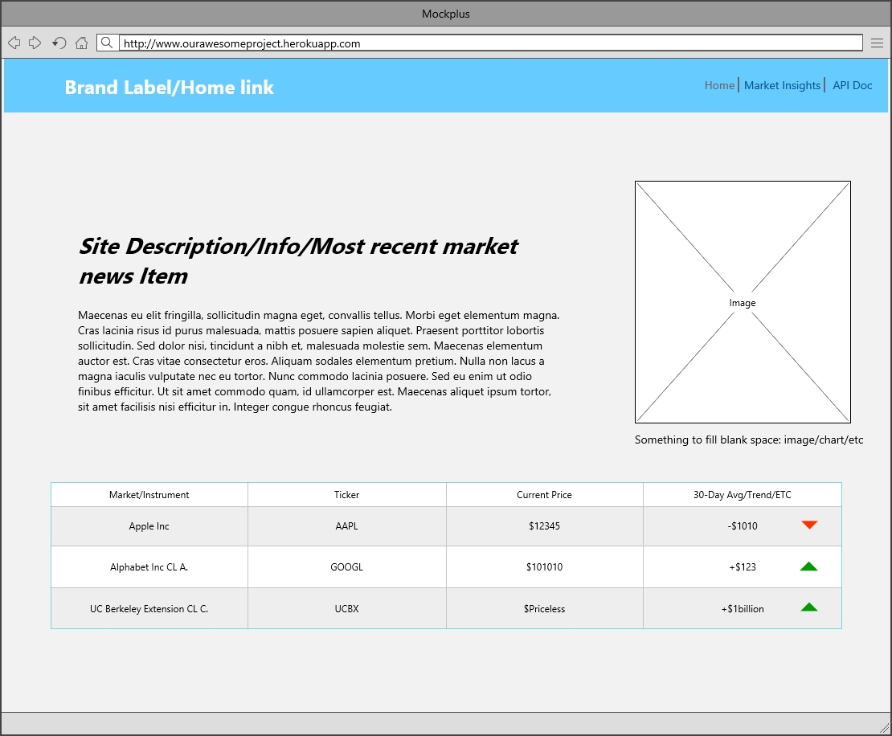
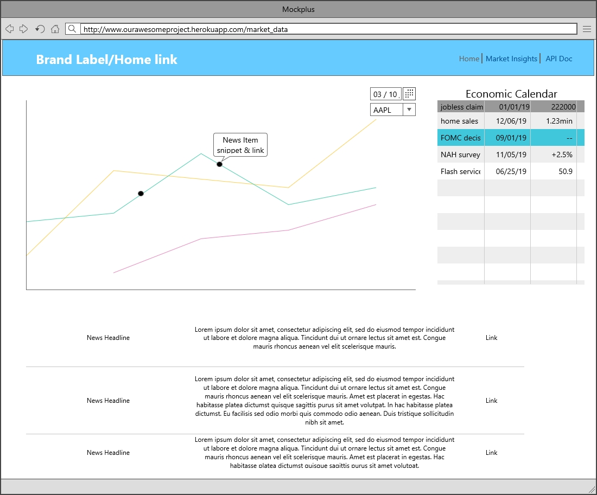

# Stock Market Analysis Dashboard

## Rationale

Within the universe of tradable financial instruments (i.e., stocks, bonds, options, futures, currencies, etc.), there are three types of analysis that can be conducted in order to more effectively speculate about what the price of a given instrument will do in the future:

* Technical,
* Fundamental, and
* Sentiment

Technical analysis focuses on price info for a given instrument, while fundamental analysis is centered on macroeconomic factors. Sentiment analysis is an attempt at gaining a sense of what the prevailing market outlook is, as it pertains to the speculative object of interest. 

The aim of this project is to incorporate all three layers of analysis into a dashboard. The user will input a stock ticker symbol (e.g., AAPL) and a date range and be served the following:

* A price chart with some basic technical indicators built in (i.e., 30-day moving average, Bollinger bands, etc.),

* An economic calendar containing the relevant macroeconomic events for the user-specified time period, along with predicted and actual values pertaining to the event, where applicable, and

* Financial news headlines from the specified time period, focused on the user-specified stock 

There is also the possibility of including visualizations of other relevant data, such as the Dow Jones Industrial Average, mortgage rates, U.S. 10-year treasury bond prices, etc.

## Datasets

* Quandl for [stock data](https://www.quandl.com/api/v3/datasets/WIKI/AAPL); possibly [Alpha Vantage](https://www.alphavantage.co/documentation/)
* Investing.com for [economic calendar](https://www.investing.com/economic-calendar/)
* Google.com for financial news headlines; possibly [stocknewsapi.com](https://stocknewsapi.com/documentation)

## Design Mockup

